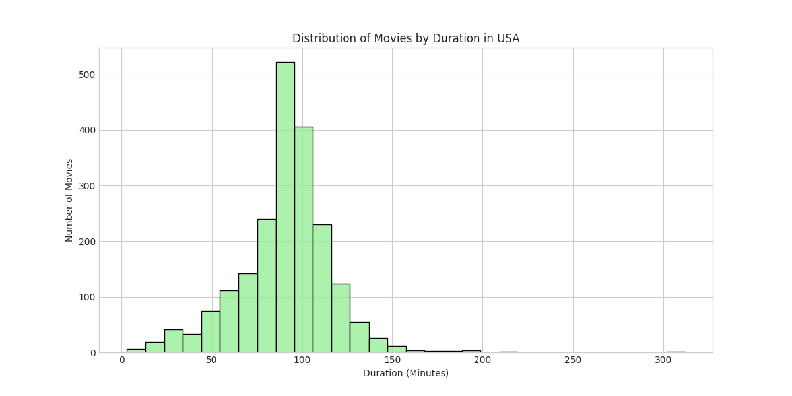
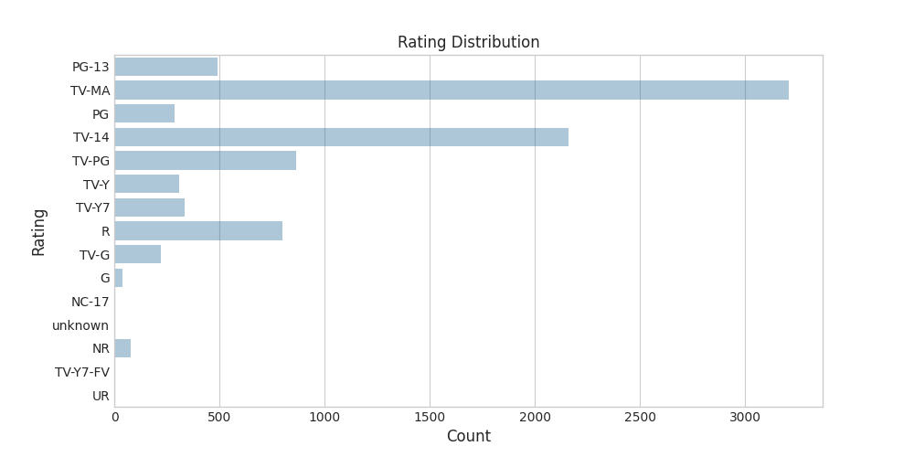
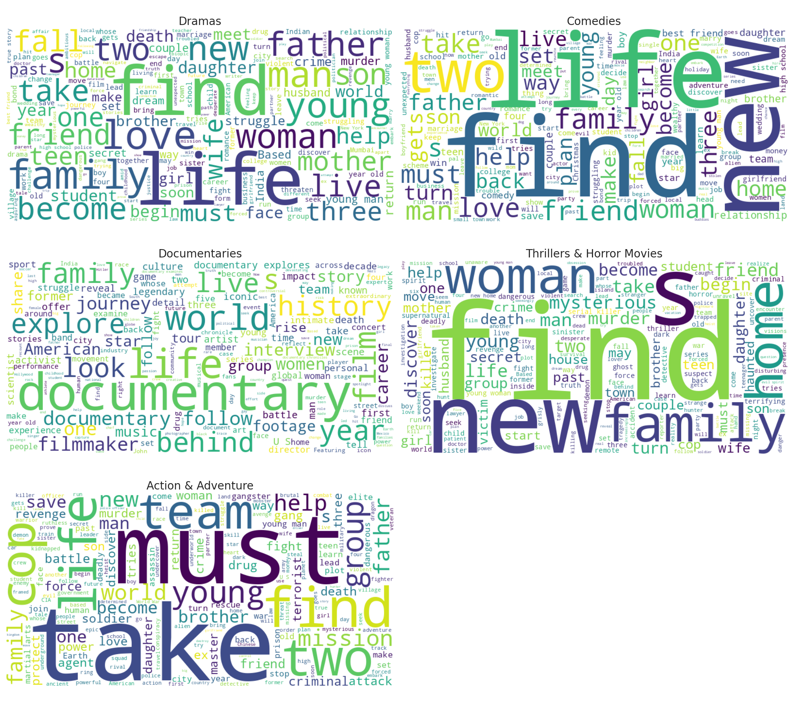

# Netflix Data Analysis


This project analyzes a Netflix dataset containing information about Movies and TV Shows available on the platform. It includes data cleaning, transformation, exploratory analysis, and visualization to draw insights about Netflix's content distribution, availability by region, and trends over time.

---

## Dataset

The dataset used in this project is `netflix_titles.csv`, publicly available and includes metadata such as:

- Title
- Type (Movie or TV Show)
- Country
- Genre (listed_in)
- Duration
- Release Year
- Description

You can download the dataset from: [Netflix Dataset on Kaggle](https://www.kaggle.com/datasets/shivamb/netflix-shows)

---

## Technologies Used

- Python 3
- Pandas
- Seaborn
- Matplotlib
- WordCloud

---

## Tasks and Objectives

### Task 0: Clean Dataset

- Fix malformed values in the `country` column (e.g., trailing commas).

### Task 1: Transform Table Structure

- Convert multi-country entries into individual rows for accurate country-level analysis.

### Task 2: List All TV Shows

- Filter dataset for `type == "TV Show"`.

### Task 3: Type Distribution

- Visualize the distribution of content types (Movies vs TV Shows).

### Task 4: Rating Distribution

- Clean invalid ratings and analyze age rating spread.

### Task 5: Genre Distribution

- Analyze how frequently each genre appears.

### Task 6: Content Per Country

- Count the number of titles available in each country.

### Task 7: Top 5 Countries - Content Type Comparison

- Compare how much of the content in top 5 countries is Movies vs TV Shows.

### Task 8: Trend Over Years (USA)

- Visualize number of releases per year by type.

### Task 9: Duration Trends (USA)

- Explore trends in movie duration and number of seasons for TV Shows.

### Task 10: WordCloud by Genre

- Generate word clouds from descriptions for key genres.

---

## Key Insights

- Movies dominate the catalog, but TV Shows are growing.
- Mature content (TV-MA, TV-14) is most common.
- Dramas and Comedies are the most popular genres.
- The United States has the most Netflix content, followed by India and the UK.
- WordClouds show genre-specific themes and keywords.

---

## How to Run

1. Clone this repository:

```bash
git clone https://github.com/npa02/netflix-data-analysis.git
cd netflix-data-analysis
```

2. Install the required libraries:

```bash
pip install -r requirements.txt
```

3. Place `netflix_titles.csv` inside the `data/` directory.

4. Run the analysis:
   - Open `Netflix_Analysis.ipynb` in Jupyter Notebook
   - Or run `python netflix_analysis.py`

---

## Sample Visualizations





---

## Future Work

    - Sentiment analysis of descriptions
    - Country-level clustering based on content
    - Content trend prediction

---

## Author

Phuong Anh Nguyen  
Contact: [npa0210@gmail.com](mailto:npa0210@gmail.com)

---

**License:** MIT

---
